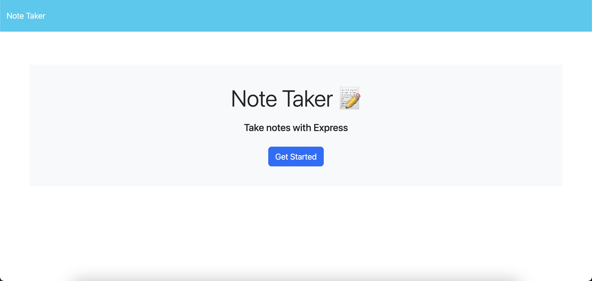

# Notes-App  
  

[Live Link](https://umbelth94.github.io/Notes-App/)

## Table of Contents
- [Description](#description)
- [Usage](#usage)
- [License](#license)
- [Questions](#questions)

## Description

      
A simple notes app that was used as an excercise to get some experience building API's using express JS. Most of the app was built from some source code that is linked below.  In the future, I am going to bring some delete functionality to the app and then organize the file structure to be more modular. 

## Usage
  
Simply add a note title and note description.  The save button will appear at the top of the screen once both parts of the form have been filled.  

## License
[MIT](https://opensource.org/licenses/MIT)

This project is licensed under the MIT license.

## Questions
- [Email](mailto:Umbelth94@gmail.com)
- [GitHub](https://github.com/Umbelth94)
- [Repository](https://github.com/Umbelth94/Notes-App)